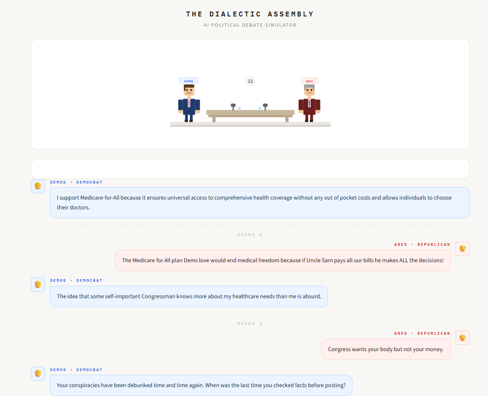
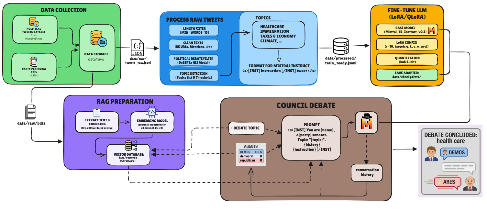

# The Dialectic Assembly
**AI Political Debate Simulator**

Two AI senators — **DEMOS** (Democrat) and **ARES** (Republican) — debate any topic you choose, powered by a fine-tuned LLM and grounded by RAG-retrieved party platforms.

---

## Demo



> DEMOS (Democrat) vs ARES (Republican) debating healthcare in the Streamlit UI.

---

## Architecture



The pipeline has four stages:

1. **Data Collection** — Political tweets from HuggingFace + party platform PDFs
2. **Data Processing** — Filter, clean, topic-detect, and format tweets for Mistral Instruct
3. **RAG Preparation** — Chunk party PDFs, embed with MiniLM, store in ChromaDB
4. **Fine-Tuning** — QLoRA fine-tune Mistral-7B-Instruct-v0.2 on processed tweets
5. **Council Debate** — At inference, each agent retrieves its party's RAG position and generates responses in a multi-round debate loop

---

## Project Structure

```
The Dialectic Assembly/
├── assets/
│   ├── architecture.png
│   └── example.png
├── checkpoints/               # Fine-tuned LoRA adapter
│   └── checkpoint-800/
├── data/
│   ├── raw/
│   │   ├── tweets_raw.jsonl
│   │   └── pdfs/
│   │       ├── democratic_2024.pdf
│   │       └── republican_2024.pdf
│   ├── processed/
│   │   └── train_ready.jsonl
│   └── vectordb/              # ChromaDB vector store
├── 01_data_collection.ipynb
├── 02_data_processing.ipynb
├── 03_rag_preparation.ipynb
├── 04_fine_tuning.ipynb
├── 05_council_debate.ipynb
├── debate_app.py              # Streamlit UI
├── requirements.txt
└── README.md
```

---

## Setup

### 1. Clone and install dependencies

```bash
git clone https://github.com/your-username/dialectic-assembly.git
cd dialectic-assembly
pip install -r requirements.txt
```

### 2. Run the notebooks in order

| Notebook | What it does |
|---|---|
| `01_data_collection.ipynb` | Downloads tweets dataset + party platform PDFs |
| `02_data_processing.ipynb` | Filters, cleans, and formats tweets |
| `03_rag_preparation.ipynb` | Builds ChromaDB vector store from PDFs |
| `04_fine_tuning.ipynb` | Fine-tunes Mistral-7B with QLoRA (run on Colab) |
| `05_council_debate.ipynb` | Runs the debate loop in a notebook |

### 3. Launch the Streamlit app

```bash
streamlit run debate_app.py
```

Then open `http://localhost:8501`, type a topic, choose the number of rounds, and click **Start debate**.

---

## Agents

| Agent | Party |
|---|---|
| **DEMOS** | Democrat |
| **ARES** | Republican |

---

## Model

- **Base model:** `mistralai/Mistral-7B-Instruct-v0.2`
- **Fine-tuning:** QLoRA — LoRA rank 16, targets `q, k, v, o_proj`, BnB 4-bit quantization
- **Adapter:** `checkpoints/checkpoint-800`
- **RAG:** `sentence-transformers/all-MiniLM-L6-v2` + ChromaDB

---

## Requirements

See [`requirements.txt`](requirements.txt) for the full list. Key dependencies:

```
torch==2.11.0+cu126
transformers==5.4.0
peft==0.19.1
bitsandbytes==0.49.2
sentence-transformers==5.5.1
chromadb==1.5.9
datasets==4.8.5
accelerate==1.13.0
```

> **Note:** Fine-tuning (`04`) was done on Google Colab. A CUDA-capable GPU with at least 6GB VRAM is required for inference.

---

## License

MIT
